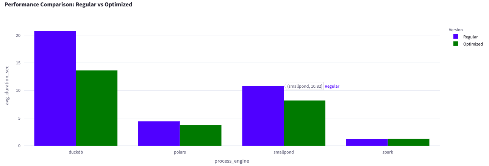

# Comparison Project
A project comparing Smallpond, Spark, DuckDB, and Polars on 100M transactions. I ran two aggregations and joined three dataframes— all to see which tool tackles big data the fastest. The workflow is simple: read from Parquet → transform → write back to Parquet. 


## output result with streamlit



## Installation

To install this project, follow these steps:

```bash
# Clone the repository
git clone https://github.com/yourusername/comparison_project.git
# Navigate to the project directory
cd comparison_project

# Install dependencies
make load_sample_dataset

# run
make run
```


## License
This project is licensed under the MIT License - see the LICENSE file for details.